

### Teil 1: Die Rolle von Informations und Kommunikationssystemen in Unternehmen

#### Kapitel 1: Information, Kommunikation, Modell und System

- **Bedeutung von informationssystemen in organisationen**

gegenstand der **Wirtschaftsinformatik** sind *Informationssysteme* (IS) in Wirtschaft, Verwaltung und dem privaten Bereich.

IS sind algegenwärtig. Nicht nur in Unternehmen haben sie einen Einfluss auf die Organisation, auf Gruppen und Individuen. Auch privat kommt jeder Mensch direkt oder indirekt mit IS in Berührung.

Zur Beschreibung dieser Entwicklung hin zu immer stärker daten- bzw. informationsgetriebenen Strukturen sowie der integralen Rolle von IT für neue Geschäftsmodelle hat sich (neben seiner ursprünglichen Bedeutung als Umwandlung analoger Signale) der Begriff der Digitalisierung im Sinne einer gesellschaftlichen Transformation etabliert.

IS können zur Verbesserung des Leistungsangebots genutzt werden und zu großen Ersparnissen führen. Die Ausnutzung der Potenziale von IT ist keineswegs einfach. Die Komplexität der Aufgaben wird offenbar oft falsch eingeschätzt, was zu großen Zeitverzögerungen und Kostenüberschreitungen führen kann. Nicht nur die Entwicklung neuer Software, sondern auch die einführung und Anpassung bereits vielfach eingesetzter Standardsoftware kann misslingen. Für private Organisationen können Probleme mit IS existenzbedrohend sein.

- **Informationen und Wissen**

**Information** ist zusätzliches zweckorientiertes Wissen.

**Daten** stellen die physische Darstellung von Informationen dar.

*Beispiel zur Unterscheidung zwischen Daten und Information*: Die Wettervorhersage für den kommenden Sommer in Kanada stellt für die meisten Europäer Daten, aber keine Informationen dar. Wenn aber der Empfänger dieser Vorhersage ein Kapitalanleger, der mit Terminkontrakten für Weizen handelt, oder jemand ist, der seinen nächsten Sommerurlaub in Kanada verbringen möchte, ist das eine wichtige Information, für die sie vielleicht viel oder wenig zahlen würden. Ob und wie viel jemand für diese Information zahlen würde, hängt auch davon ab, für wie zuverlässig er die Information hält.

**Nachrichten** sind übermittelte Daten, unabhängig davon, ob sie durch Personen oder über Leitungen übermittelt werden.

**Kommunikation** ist Austausch von Nachrichten.

Die obige Definition von Information ist nicht leicht quantifizierbar. Deshalb (Shannon und Weaver 1949) sehen **Information als Mittel zur Reduktion von Unsicherheit** und messen dieses Reduktionspotenzial mit der **Entropiefunktion**, hier mit H bezeichnet:

wobei p(i) die Wahrscheinlichkeit eines Ereignisses ist. Je höher der Wert von H ist, desto größer sind die Unsicherheit und damit die Möglichkeit, mithilfe von Informationen die Unsicherheit zu reduzieren. Wenn keine Unsicherheit besteht, also ein Ereignis mit Sicherheit von p(i) = 1 auftritt, dann ist H = 0 bzw. zusätzliche Informationen haben keinen Wert.

*Beispiele für Entropie bei fairen und unfairen Münzwurf:*

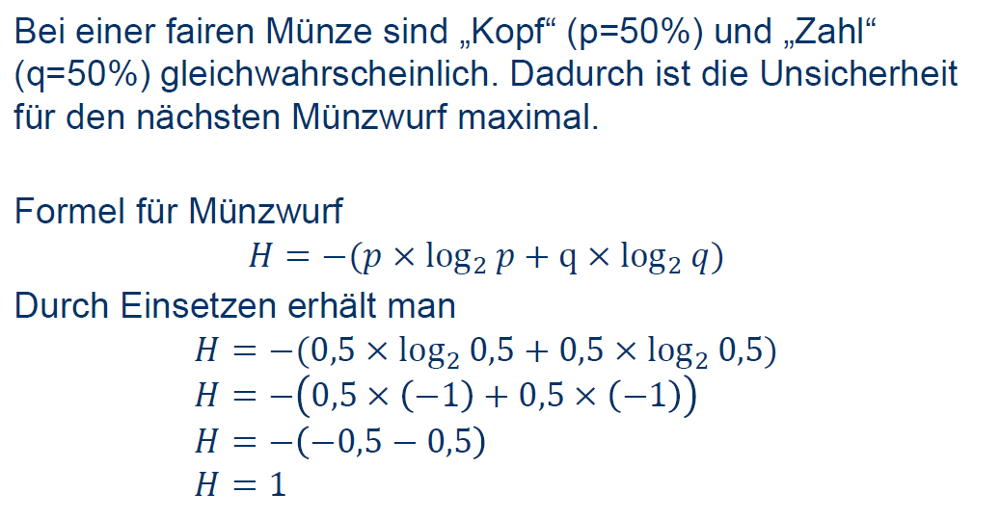
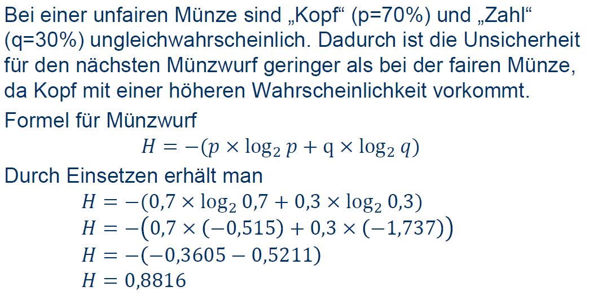

Eine Information kann viele Eigenschaften haben, die ihren Wert beeinflussen. **Aktualität** bezieht sich auf die Frage, wie weit in der Zeit der Zustand zurückliegt, auf den sich die Information bezieht. **Korrektheit** bezieht sich auf den Wahrheitsgehalt der Information. **Genauigkeit** bezieht sich auf die Präzision der Information. Der **Aggregationsgrad** von Informationen sagt etwas über die Bezugsobjekte oder -ereignisse aus. Die **Präsentation** einer Information ist ebenso wichtig, da die volle Ausschöpfung des Informationswerts davon abhängt, dass der Empfänger die Information vollständig aufnimmt. Die **Kosten** einer Information sind insbesondere bei ex ante (von Anfang an) Betrachtungen wichtig, wenn über die Beschaffung der Information entschieden werden muss.

*Folgend sind einige Informationsattribute und ihre möglichen Ausprägungen dargestellt.*

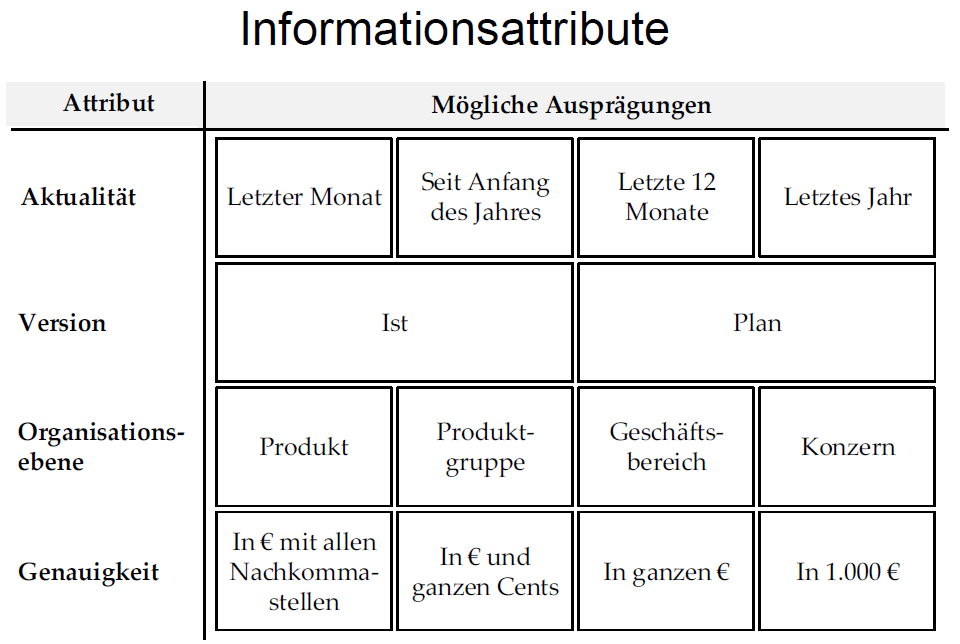

* **Problemlösungsprozess**

Generell werden Informationen benötigt, um eine Entscheidung zu treffen oder eine Kontrolle vorzunehmen. Informationen sind als Rohstoff für Entscheidungs- und Kontrollprozesse zu betrachten.

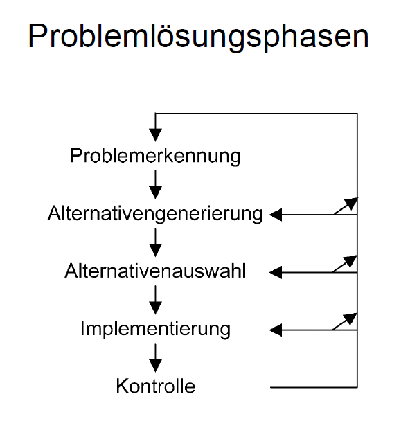
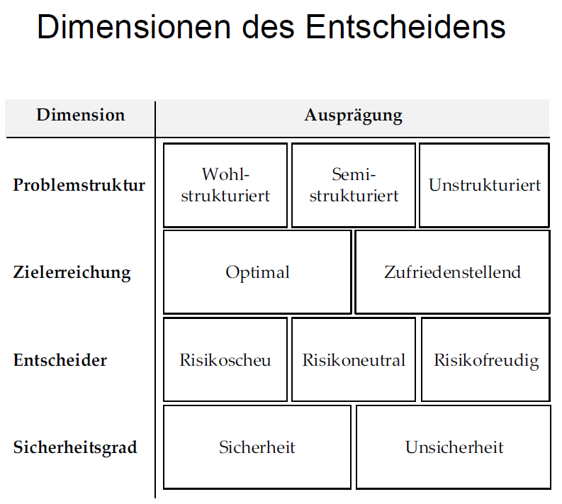

Wenn eine Entscheidungsträger hinsichtlich eines Problems zu jeder der Phasen ein geeignetes Vorgehen kennt, ist das Problem für ihn **wohlstrukturiert**. Im anderen Extremfall, wenn zu keiner der Phasen ein geeignetes Vorgehen bekannt ist, wird das Problem als **unstrukturiert** bezeichnet. Dazwischen sind die **semistrukturiertem** Probleme. Hier sind Lösungsansätze zwar für einige der Phasen, aber nicht für alle Phasen bekannt.

In der Entscheidungstheorie wird zwischen Entscheidungen unter **Sicherheit** und unter **Unsicherheit** unterschieden. Im ersten Fall liegen sämtliche Prognosedaten über die Entscheidungskonsequenzen der zu beurteilenden Alternativen in einwertiger Form vor. Bei Entscheidungen unter Unsicherheit werden die Konsequenzen mehrwertig notiert. Mehrwertigkeit liegt z.B. dann vor, wenn Vorhersagen für verschiedene Szenarien getroffen werden.

Die Persönlichkeit des Entscheidungsträgers drückt sich auch in seiner Risikoeinstellung aus. Diese kann aufgrund des **Nutzenerwartungswerts** bei einem zufallsbedingten Ereignis bestimmt werden:

wobei p(i) die Eintrittswahrscheinlichkeit des Ereignisses x(i) ist und N(x(i)) der Nutzen, den der Entscheidungsträger dem Eintreten des Ereignisses x(i) beimisst. Der Nutzenerwartungswert kann mit einem sicheren Wert verglichen werden, dem sog. *Sicherheitsäquivalent*, den der Entscheider auswählt bzw. bei einem Glücksspiel als Spieleinsatz akzeptiert. Wenn die beiden Werte gleich sind, dann wird der Entscheider als **risikoneutral** bezeichnet. Wenn sich der Entscheider für ein ihm angbotenes Sicherheitsäquivalent entscheidet, das kleiner als der Nutzenerwartungswert ist, dann ist der Entscheider **risikoscheu**; wenn er sich für den höheren Nutzenerwartungswert entscheidet, ist er **risikofreudig**. Im letzteren Fall zieht er die Chance auf den Erhalt eines größeren Nutzens einem sicheren, kleineren Nutzen vor.

- **Wert von Informationen:**
1. **Subjektiver Ansatz**:

Man befragt den Informationsbenutzer, wie viel ihm die Information wert ist. Dieser Ansatz wird insbesondere dann gewählt, wenn es sich um unstrukturierte Probleme unter Unsicherheit handelt. Seine Stärke, die nachfragebezogene Wertbestimmung, ist gleichzeitig auch seine Schwäche, nämlich die mangelnde Nachprüfbarkeit der Korrektheit. Es ist möglich, den Grad der Subjektivität zu verringern, indem mehrere Benutzer in einer Organisation befragt und die Antworten in geeigneter Weise zusammengefasst werden.

2. **Objecktiver Ansatz**:

Ein objecktiver Ansatz ist die Ermittlung des beobachtbaren Werts von Informationen. Dabei wird das Ergebnis eines Entscheidungsprozesses mit und ohne eine bestimmte Information betrachtet. Die Ergebnisdifferenz entspricht dem Informationswert, wenn man all anderen Einfüsse konstant halten kann (in dieser Bedingung verbirgt sich die Schwierigkeit des Ansatzes). Der Vorteil besteht darin, dass er die tatsächlich erreichten Ergebnisse berücksichtigt und damit die Fähigkeiten und Zielerreichungsbedürfnisse der Entscheidungsträger. Ein Nachteil ist, dass der Wert nur ex post ermittelt werden kann, wenn man die Information schon erworben hat. Die Wertermittlung kann jedoch auch für diesen Fall sinnvoll sein, um für den Wiederholungsfall zu lernen.

3. **Normativer Ansatz**:

Ein normativer Ansatz, der auch ex ante angewendet werden kann, ist die Bestimmung des normativen Werts der Information. Hier wird der Informationswert durch die Differenz des erwarteten Gewinns mit der betreffenden Information und dem erwarteten Gewinn ohne die Information gemessen. Der Nachteil dieses Verfahrens ist, dass die Güte der Information nicht leicht bestimmbar und nachprüfbar ist.

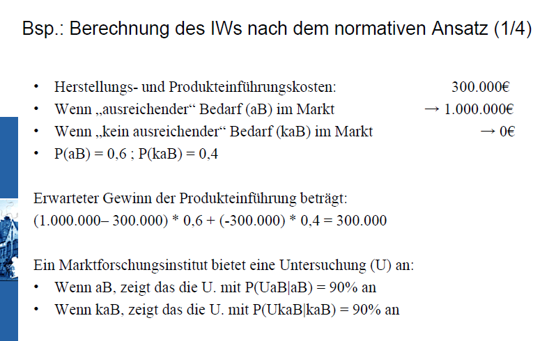
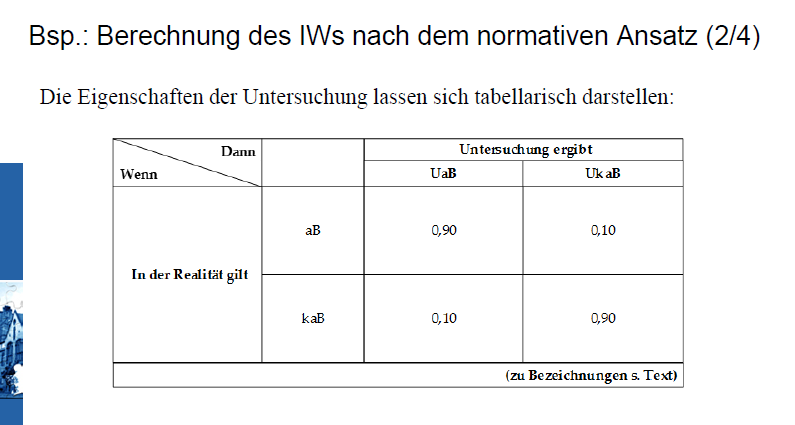
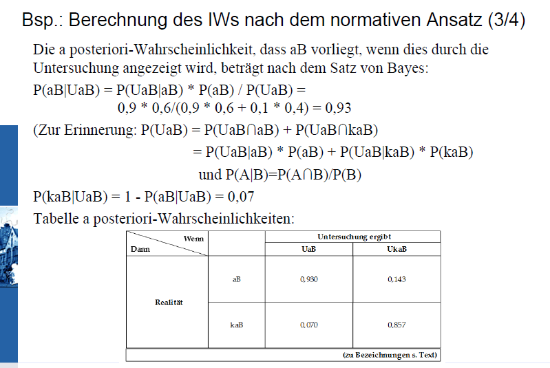
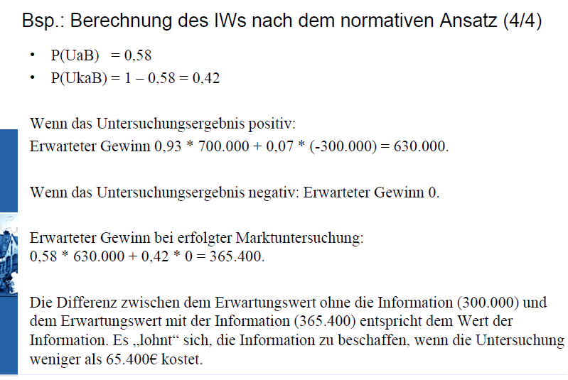

In der Praxis wird der Wert einer Information oft nicht im Kontext von "mit" oder "ohne" Information ermittelt, sondern es werden Informationen mit unterschiedlichen Ausprägungen eines oder mehrerer Attribute betrachtet, um eine zufriedenstellende Konstellation auszuwählen.

Abschließend ist festzuhalten, dass das Ergebnis eines Entscheidungsprozesses, in den Informationen eingeflossen sind, wiederum eine Information darstellt.

* **System**

Ein **System** besteht aus einer Menge von miteinander verknüpften Elementen, die sich insgesamt von ihrer Umgebung abgrenzen lassen.
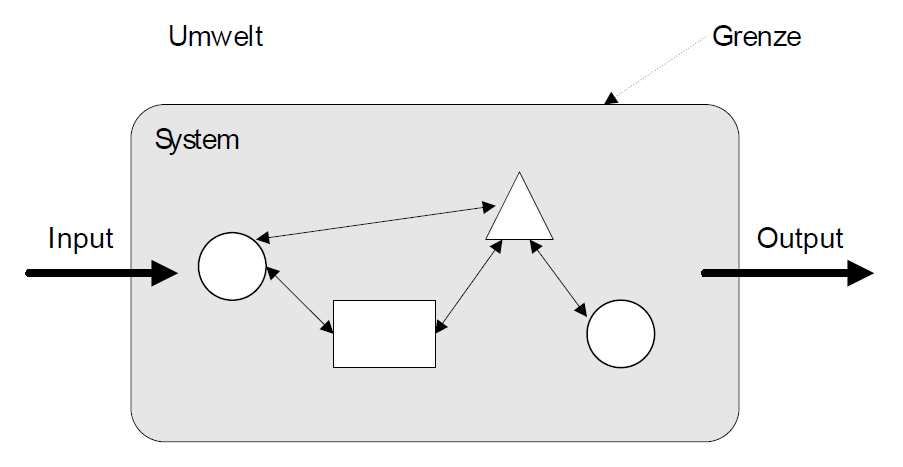

Diese Grafik enthält zusätzlich Eingaben und Ausgaben, die das System mit der Umwelt austauscht. Diese sind in der Definition nicht enthalten, weil es geschlossene Systeme gibt, die mit ihrer Umwelt nichts austauschen.

Die Ermittlung der Grenzen eines Systems und der Beziehungen zwischen seinen Elementen können schwierig sein. Wenn man an den Elementen und ihren Beziehungen nicht interessiert ist, sondern nur an der Verwendung eines Systems, dann bezeichnet man das System als eine "Blackbox". Es reicht oft aus zu Wissen, welche Inputs zu welchen Outputs führen, um ein System zu nutzen. Ein Element eines Systems kann ebenfalls ein System sein (Subsystem).
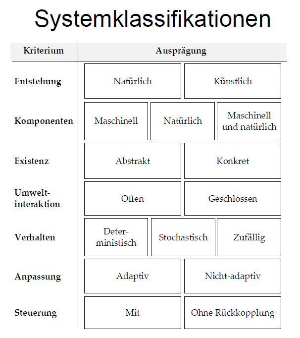

Ein System, dessen Verhalten exakt vorraussagbar ist, wird als **deterministisch** bezeichnet. Wenn das Verhalten (nur) einer Komponente eines Systems einer Wahrscheinlichkeitsverteilung folgt (z.B. bezüglich ihres Ausfalls), so ist das gesamte System **stochastisch**. Wenn ein Beobachter nicht einmal Wahrscheinlichkeiten für das Verhalten eines Systems kennt, verhält sich das System für ihn **zufällig**.

In vielen Organisationen werden die realisierten Ergebnisse regelmäßig mit angestrebten Zielen verglichen. Wenn die Übereinstimmung als nicht zufriedenstellend angesehen wird, werden die Systemeingaben und/oder das interne Systemverhalten geändert. Man spricht hier von **Rückkopplung**.

* **Modell**

Ein **Modell** ist das Ergebnis eines Konstruktionsprozesses, das die Wahrnehmung von Inhalten eines ausgewählten Gegenstands zweckorientiert repräsentiert. In Modellen werden die für nicht relevant angesehenen Eigenschaften eines Systems weggelassen. Mit einem Modell kan somit einfacher experimentiert werden, um das zu analysierende System bzw. das Original besser verstehen bzw. steuern zu können, ohne dieses selbst zu beeinflussen. Die Qualität des Modells ist daran zu beurteilen, inwiefern die Repräsentation geeignet ist, die Zwecke des Modellnutzers zu erfüllen.

``

\begin{figure}
\centerline{\includegraphics[width=0.8\textwidth]{img/modellcl.png}}
\caption{fake and gay}
\end{figure}

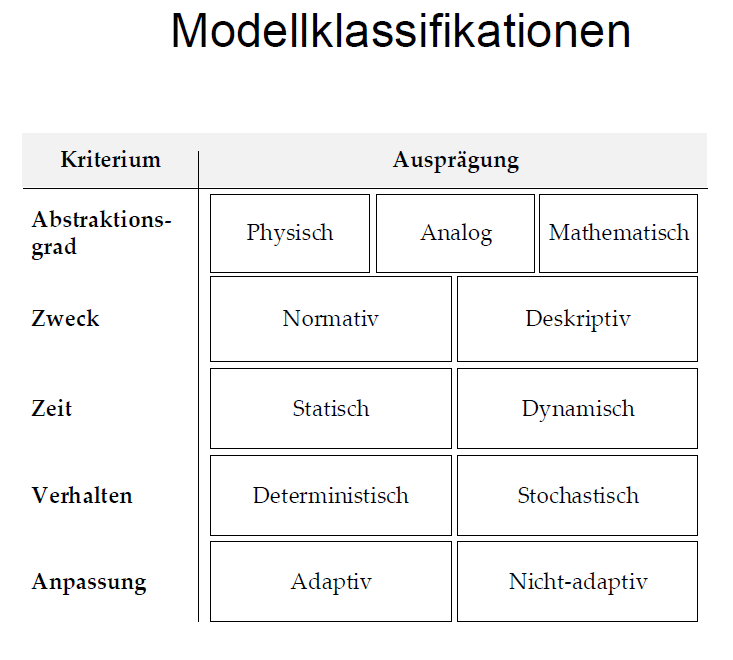

Der Zweck eines Modells kann sein, ein System zu beschreiben (**deskriptiv**) oder Handlungen zu empfehlen (**normativ**). Wenn das Modell Größen beinhaltet, die sich auf mehr als einen Zeitpunkt beziehen, wird von einem **dynamischen** (also **mehrperiodigen**) Modell gesprochen. In **statischen** (**einperiodigen**) Modellen beziehen sich alle Variablen auf den gleichen Zeitpunkt bzw. Zeitraum.

* **Modelle von Unternehmungen**

Aus der Sicht der Systemtheorie enthalten Organisationen i.d.R. maschinelle und natürliche Komponenten und sind meistens offene, adaptive Systeme mit Rückkopplung. Da eine Organisation viele Komponenten enthält, ist zwecks Erreichung der Organisationsziele eine Koordination dieser Komponenten notwendig. Diese Koordination wird durch eine Aufbausorganisation, die Aufgaben, Aufgabenträger und ihre formalen Beziehungen untereinander festgelegt, und durch eine Ablauforganisation, die Arbeitsabläufe bestimmt, unterstützt.

In vielen Organisationen herrscht hierarchische Koordination mit einer oder mehreren Leitungsebenen vor. Die Leitungs- oder Managementfunktionen werden oft in drei Ebenen unterteilt. Die Manager einer Ebene haben Mitarbeiterverantwortung für die unteren Ebenen. In der näschten Abbildung sind die Leitungsebenen um die Ausführungebenen ergänzt, damit die gesamte Unternehmung in dem Modell repräsentiert wird. Die Linien die die Pyramide vertikal unterteilen, trennen die verschiedenen funktionalen Bereiche, wie etwa Beschaffung, Produktion oder Vertrieb, voneinander ab.
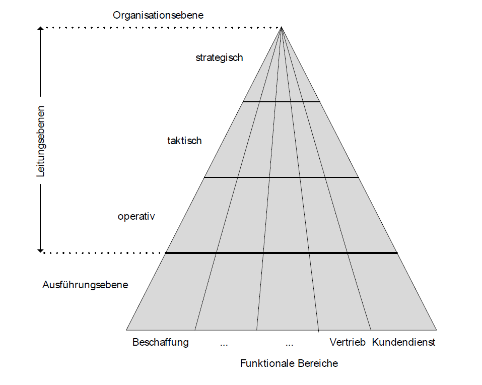

Die unterschiedlichen Aufgaben der Manager auf den drei Ebenen führen zu unterschiedlichen Informationsbedürfnissen. Diese werden in der nächsten Tabelle dargestellt. Dabei sind die Einträge so zu interpretieren, dass z.B. bezüglich der Herkunft der Informationen die operative Ebene vorwiegend interne Informationen benötigt, die strategische Ebene vorwiegend externe Informationen und die taktische Ebene dazwischen liegt.
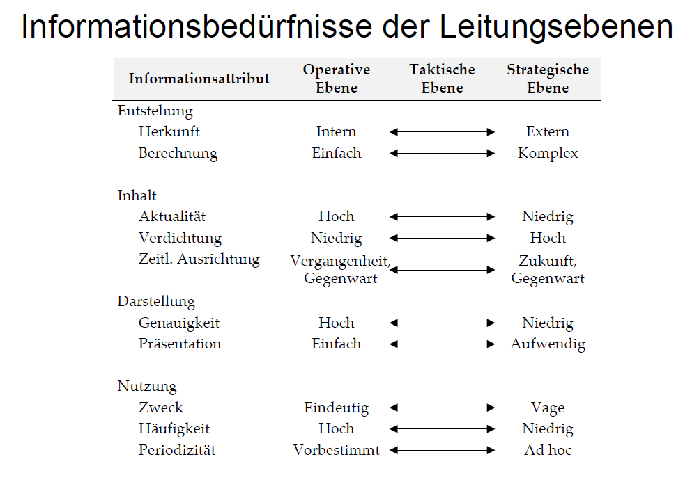

Heute wird versucht, "flache" Organisationen mit möglichst wenig Personal, das nur überwacht und informiert, zu entwickeln. Die Entwicklung solcher Organisationen unterstützen IS erheblich. Die vorher genannten planerischen Aufgaben existieren trotz Verflachung der Organisation weiter.

Das Handeln einer Unternehmung beeinflussen nicht nur ihre Mitarbeiter und ihre direkten Geschäftspartner, sondern eine Vielzahl an Interessengruppen. Diese Gruppen werden gleichzeitig durch das Handeln der Unternehmung beeinflusst. Das gezeigte Modell einer Unternehmung als Führungssicht versucht, die Komplexität ihrer Beziehungen durch sechs Grundkategorien einzufangen:

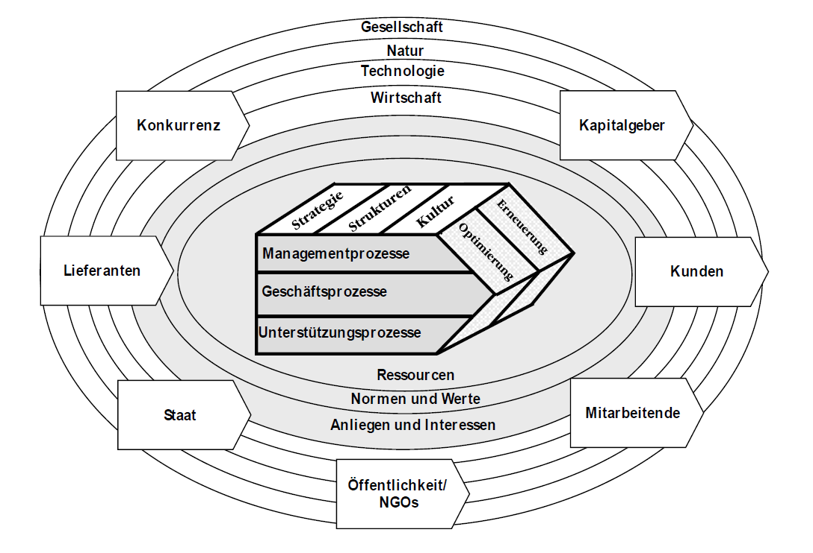

1. *Umweltsphären* (Gesellschaft, Natur, Technologie, Wirtschaft) sind Rahmenbedingungen, die ständig auf Veränderungen beobachtet werden sollten und teilweise beeinflusst werden können.
2. *Anspruchsgruppen* (Kapitalgeber, Kunden, Mitarbeitende, usw.) stehen in beabsichtigten Austauschprozessen mit der Unternehmung oder werden von ihren Handlungen mehr oder weniger zufällig betroffen (z.B durch Umweltbelastung oder Sponsoring).
3. *Interaktionsthemen* (Ressourcen, Normen und Werte, Anliegen und Interessen) repräsentieren den Austausch zwischen der Unternehmung und den Anspruchsgruppen, der materieller (Güter) oder immaterieller (z.B. Rechte, Anliegen oder Normen) Art sein kann.
4. *Ordnungsmomente* (Strategie, Strukturen, Kultur) stellen das interne Rahmenwerk der Unternehmung dar, indem sie Ziele und formale/informale Kommunikationsstrukturen bestimmen.
5. *Prozesse* bilden die sachlichen und zeitlichen Bedingungen und Abfolgen der Leistungserbringung ab.
6. *Entwicklungsmodi* (schattierte Seitenfläche des Polyeders) zeigen Möglichkeiten der Weiterentwicklung auf, die aus der Verbesserung bestehender Prozesse (Optimierung) oder aus der Transformation unter Ausnutzung von Innovationen (Erneuerung) bestehen.
